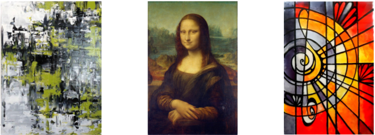
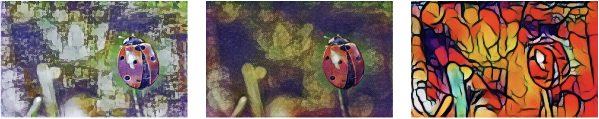
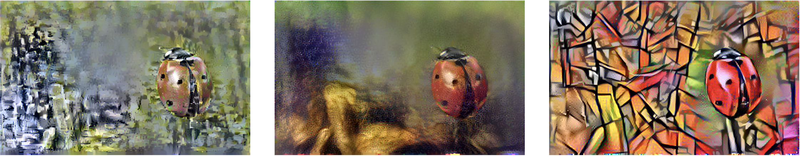

This repository demonstrates Neural Style Transfer (NST) technique implemented on TensorFlow 2.1 environment. The content of this repository is purely for education purposes.

# What is Neural Style Transfer?
The basic idea for Neural Style Transfer is to extract the learned representation from a pretrained neural network (typically Convolutional Networks), and optimise the **generated pixels** against a pair of images: Content(C) and Style(S). The synthesised image is expected to have the grooves and motives of the _style_ image, whilst preserving the original _content_.

You will need to provide a content:

Pair this with a desired style:

To synthesis a new image:

Happy learning!

The image, algorithm, and the base content belongs to its original respective owners.
